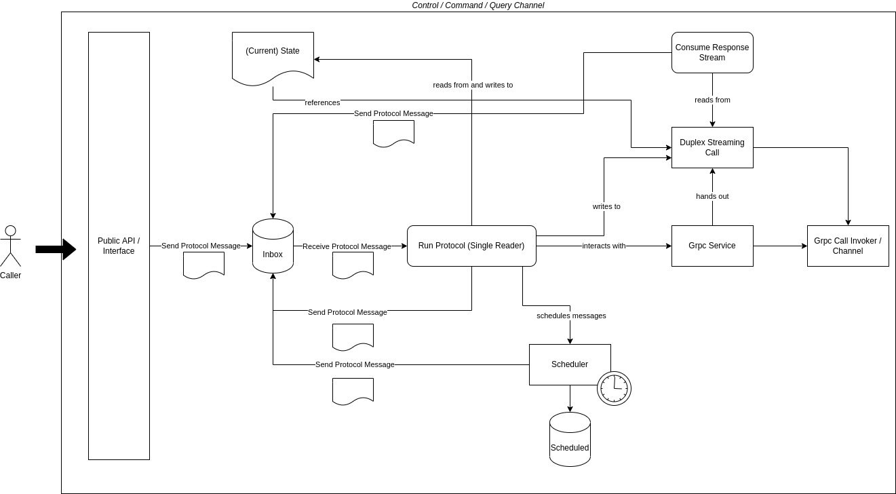

Similarly to the Java Connector for Axon Server, `AxonServerConnection`s get handed out to by the `AxonServerConnectionFactory`.
The connection factory keeps track of all handed out connections so far.
Connections are context bound, meaning that if you ask for the same context twice, you get back the same connection.
For most applications, the `AxonServerConnectionFactory` and `AxonServerConnection` can be treated as singletons, meaning only a single instance needs to exist.
There's nothing in the design that stops you from creating multiple, but that should not be the general guidance given to callers.
The underlying gRPC channels are not cheap to set up, so this guidance is inline with what happens under the hood.

.NET has pretty much streamlined dependency injection in the form of `Microsoft.Extensions.DependencyInjection`.
The `ServiceCollectionExtensions` ease the registration of an `AxonServerConnectionFactory` instance and associated configuration options.
Connecting to a context initiates establishing a connection to the configured Axon Server but does not wait until connection has been completed.
For convenience, there a couple of ways you can wait for that condition to become true on the `AxonServerConnection` itself.
One is to use to await the `WaitUntilConnected()` method.
Another is to observe the `Connected` [event](https://learn.microsoft.com/en-us/dotnet/standard/events/).
Yet another is probing the `IsConnected` property.
The same methods also exist for a connection to become `Ready`.

> - Connected means that a gRPC channel was setup with the Axon Server.
> - Ready means that not only was a gRPC channel set up with Axon Server, but the control channel stream has been successfully opened.

Each Axon Server Channel in the .NET connector for Axon Server has a public interface.
It's this public interface that callers can interact with.
Callers gain access to these channels via properties on the `AxonServerConnection`.
You'll find one for the `AdminChannel`, `ControlChannel`, `CommandChannel`, `EventChannel` and `QueryChannel`.

The `ControlChannel`, `CommandChannel`, and `QueryChannel` all follow a similar internal design as depicted below.

Inside each one of those Axon Server Channels a `System.Threading.Channels.Channel` acts as a queue, an inbox of messages.
The messages are part of a protocol that together describe the work the Axon Server Channel performs.
Some of these messages come from the public api, when the caller wants something done, such as sending a command or registering a command handler for example.
Other messages may come from Axon Server when it replies to a previously sent gRPC message or sends an instruction the Axon Server Channel should perform.
Yet another set of messages may come from a `Scheduler` when the work to be performed has been delayed, such as reconnecting after 500ms.

There's one big message loop running inside the Axon Server Channel, that effectively receives and executes the protocol messages.
The side effect of handling a protocol message is closely related to what the protocol message implies.
It could change the state of the Axon Server Channel, send a gRPC message to Axon Server, dispatch a received gRPC message to a callback handler the caller registered, or a combination of these things.
Having a single big message loop that changes the state of the Axon Server Channel is beneficial because we can forego any sort of locking.
Why? There's only one thread ever accessing that state.
The flip side is that we now have the responsibility to make sure that loop keeps running.
Not only that, it needs to run pretty darn fast too.
Why? On the one hand because we do not want to buffer too many protocol messages.
On the other hand because we do not want to hinder the overall throughput.
There are two key areas we must pay attention to.
One is the interaction with caller code, e.g. we have no way of knowing how long handling a command will take.
Commands must not be handled in a sequential fashion.
For this reason work is kicked off as task we do not await inside the loop, thereby unblocking the loop itself, allowing it to pick up and handle the next protocol message.
The other is the interaction with a gRPC channel.
Given the speed at which gRPC operates, the act of sending can be done inside the loop.
But there are many reasons why a gRPC call would fail.
None of them should cause the loop to break.

The `ControlChannel`, `CommandChannel`, and `QueryChannel` each open a relatively long-running full duplex streaming gRPC call with Axon Server.
There's another relatively long-running loop inside the Axon Server Channel.
This loop is responsible for receiving messages from the full duplex streaming gRPC call and putting them in the inbox as protocol messages.
It lives for as long as that call lives.

